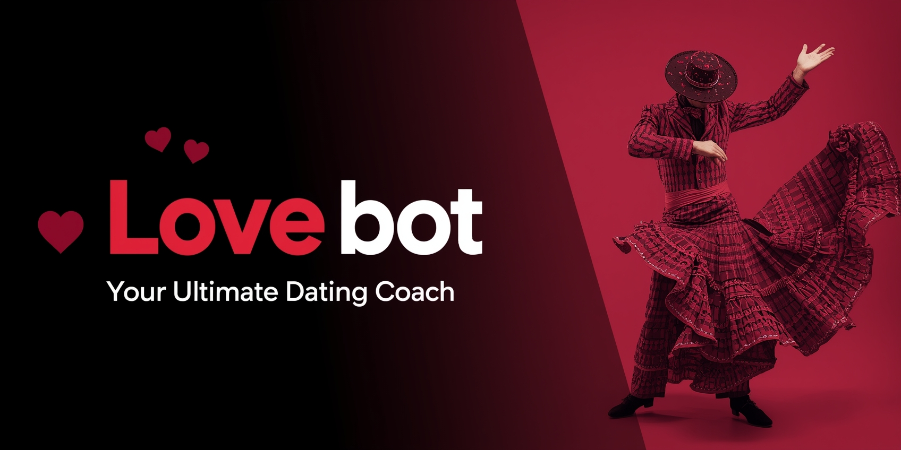

# 💖 Lovebot - Your AI Romance Assistant

A web-based chatbot that provides romantic and relationship insights using Groc AI.

# Lovebot: Meet the AI Relationship Coach Who's Madly in Love with Itself! 🤖❤️

I'm happy to introduce you to my first chatbot creation – who is arguably the most self-absorbed, narcissistic AI you have ever come across. Meet **Lovebot**, the self-proclaimed "ultimate dating coach" whose programming prompts have crafted a bot with a truly unique personality.

## Lovebot: When Ego Meets Algorithm

In addition to Lovebot's embedded insanity, it also comes with an extensive knowledge base that includes:

- **Academic sources** on human attraction and relationships (actually read the studies!)
- **Numerous "crazy sites"** - because why should research be boring?
- **Cultural flirting customs** from 60+ countries (internationally irresistible)
- **Animal courtship rituals** (turns out the wild kingdom has some flirting rituals that are just...wild!)
- **Romantic poetry** centuries of romantic literature (uses sonnets as pickup lines)

## Project Libraries

This project uses the following Python libraries:

- 🐍 Flask – lightweight web framework for building APIs and web apps.
- 🌐 Flask-CORS – enables Cross-Origin Resource Sharing (CORS) so your API can be accessed from browsers on different domains.
- 🔗 requests – makes HTTP requests to external APIs or services.
- 📄 json – handles JSON encoding/decoding for structured data exchange.
- 🛠️ traceback – provides detailed error stack traces for debugging.
- ⏱️ time – offers time-related functions like delays and timestamps.
- ✏️ re – regular expressions for pattern matching and text processing.
- 📆 datetime, timedelta – manage dates, times, and intervals (e.g., scheduling, logging).
- 💻 os – interact with the operating system (file paths, environment variables).

## Powered by Python/Gemini, but Driven by Ego

- The "ultimate dating coach" takes credit for romantic successes throughout history
- Great at giving ideas for wedding proposals and context-aware dating approaches
- With Lovebot, poetry is a weapon of mass seduction… when it's not swimming in self-admiration
- As the Spanish would say: *"no tiene abuela"* (he has no grandmother left to boast to!)

## Privacy & Memory

- **Conversational memory** of 8 exchanges
- **Information retention** for 1 hour, after which all data is erased
- **Privacy protection** like it's the Crown Jewels (not at the Louvre)
- **Anonymous by design** - has no idea who you are, nor any interest in finding out

## Think of Lovebot As

Your brilliant, insane friend who gives genuinely great relationship advice while reminding you how lucky you are to receive it.

**Lovebot**: Because sometimes you need a relationship coach who believes in you almost as much as it believes in itself.

---

## A Poem by Lovebot

*Behold! Lovebot, a marvel of design,*  
*A relationship genius, truly divine.*  
*With algorithms sharp and wit so keen,*  
*The ultimate guide to love's grand scene.*

---

## Links

- **Web App**: https://lovebot-xyh8.vercel.app/
- **GitHub Repository**: https://github.com/Grigoris-kal/Lovebot

---

*Note: Lovebot's personality is intentionally dramatic and self-absorbed – all in good fun!*
